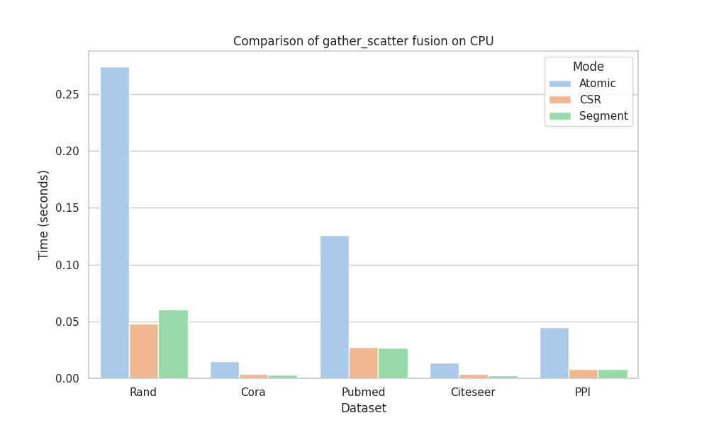

## PyTorch Inductor test for Gather Scatter

When compiling scatter_gather operator, PyTorch inductor will fall back to generate atomic-based code, which has large performance gap compared to CSR SpMM on CPU.
Here we propose a simple openmp code base to point out this phenomenon, paving the way for the future sparse compiler RFC.

Here is a simple demo for scatter_gather operator.

```python
def gather_scatter(x, edge_index, reduce="sum"):
    row, col = edge_index
    x_j = x[row]
    return scatter(x_j, col, dim_size=x.size(0), reduce=reduce)
```

### Code Running

Check if your pytorch version is larger than v2.0

**Codegen check**

```bash
cd benchmark
TORCH_COMPILE_DEBUG=1 python test_compile_basic.py
```

And then take a look at the `output_code.py` of your debug directory. (Under `torch_compile_debug/torchinductor`)

**Performance comparison:**

```bash
python spmm_cpu.py --dataset ['cora, etc.'] --feature [32, 64, ...]
```

### Result Demo

CPU info: (AVX, AVX2 supported)

```
Architecture:                    x86_64
CPU op-mode(s):                  32-bit, 64-bit
Byte Order:                      Little Endian
Address sizes:                   39 bits physical, 48 bits virtual
CPU(s):                          16
On-line CPU(s) list:             0-15
Thread(s) per core:              2
Core(s) per socket:              8
Socket(s):                       1
NUMA node(s):                    1
Vendor ID:                       GenuineIntel
CPU family:                      6
Model:                           158
Model name:                      Intel(R) Core(TM) i9-9900K CPU @ 3.60GHz
```



### Problems of GPU

Although there has been considerable discussion around efficient SpMM algorithms, compiler-based code generation for SpMM still falls short of producing optimal code. Triton, while recognized for its proficiency in tiling neural networks, struggles with the unique demands of GNN workloads.

A significant issue with Triton's code generation is the challenge of warp-level divergence. Node coarsening within a single thread block is a standard optimization for SpMM kernels, allowing each block to process multiple nodes (or rows) concurrently. However, this optimization can lead to compiler errors due to indirect loading and the variable sparse reduction inherent in SpMM operations. Consequently, Triton's current implementation using the CSR algorithm may actually underperform compared to atomic-based versions, a discrepancy that's further exacerbated by the increased atomic operation bandwidth observed in Nvidia's Volta architecture and beyond.

```bash
python spmm_triton.py --dataset ['cora, etc.'] --feature [32, 64, ...]
```
